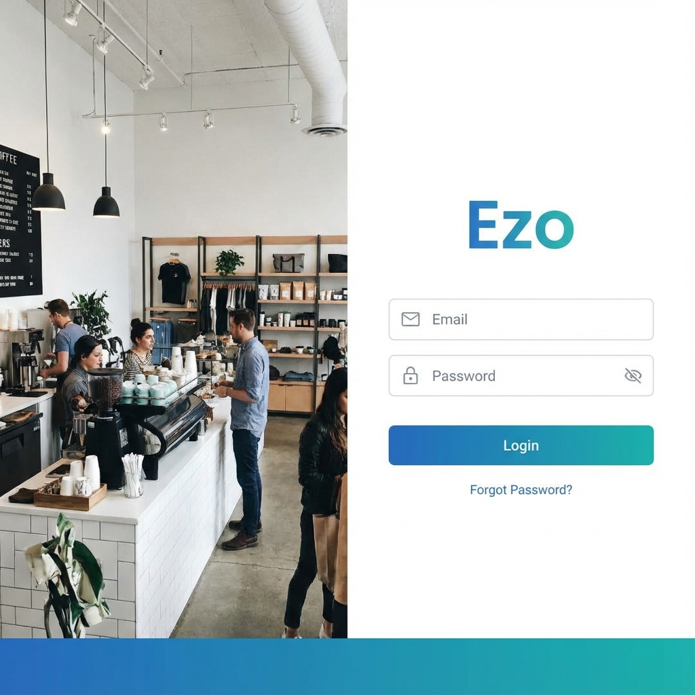
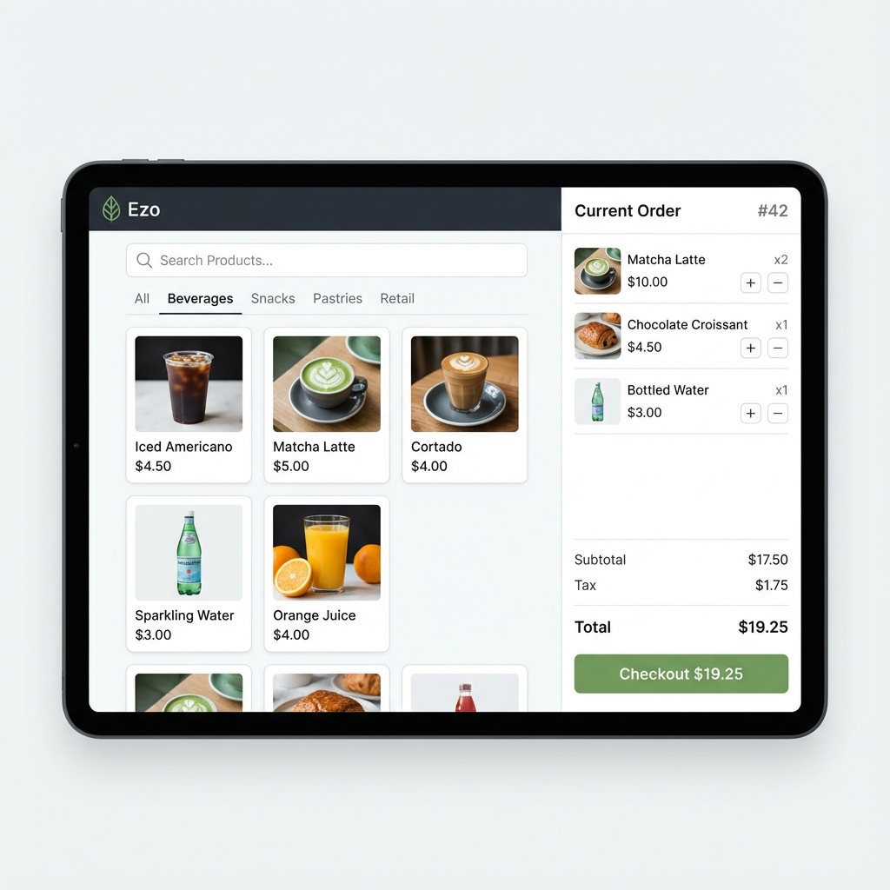

# Software Requirements Specification (SRS)
## Ezo POS System

**Version:** 1.0  
**Date:** 2025-12-26  
**Status:** Draft

---

## 1. Introduction

### 1.1 Purpose
The purpose of this document is to present a detailed description of the "Ezo" Point of Sale (POS) system. It will explain the purpose and features of the system, the interfaces of the system, what the system will do, the constraints under which it must operate, and how the system will react to external stimuli. Keep in mind this document is intended for both the developers and the stakeholders of the project.

### 1.2 Scope
"Ezo" is a modern, cross-platform POS application designed for small to medium-sized retail businesses (cafes, retail stores, kiosks). The system runs on desktop environments (Linux/Windows/macOS) via Flutter, providing a robust offline-first architecture with local database synchronization.

**Key Features:**
*   **Point of Sale (POS):** Efficient checkout interface with product browsing, cart management, and payment processing.
*   **Inventory Management:** Real-time tracking of products, categories, and units.
*   **Sales & Reporting:** Visual dashboard for sales trends, transaction history, and exportable reports.
*   **User Management:** Role-based access control for Admins and Staff.
*   **Customer & Supplier Management:** Database of contacts for CRM functionality.

### 1.3 Definitions and Acronyms
*   **POS:** Point of Sale
*   **SRS:** Software Requirements Specification
*   **MVVM:** Model-View-ViewModel (Architectural Pattern)
*   **Drift:** A reactive persistence library for Dart/Flutter (SQLite ORM)
*   **CRUD:** Create, Read, Update, Delete
*   **SKU:** Stock Keeping Unit
*   **UUID:** Universally Unique Identifier

---

## 2. Overall Description

### 2.1 Product Perspective
Ezo is a standalone client application with potential for cloud enhancements. It relies on a local SQLite database for data persistence, ensuring functionality even without an internet connection. It is built using the Flutter framework to ensure UI consistency across different operating systems.

### 2.2 User Characteristics
*   **Administrator:** Has full access to all system features including configuration, user management, and sensitive reports.
*   **Staff/Cashier:** Restricted access primarily to the POS interface for processing sales and basic customer entry.

### 2.3 Operating Environment
*   **Client OS:** Linux (primary target), Windows 10/11, macOS.
*   **Hardware:** Standard desktop or touch-enabled POS terminal.
*   **Software Dependencies:** Flutter runtime, SQLite libraries (`sqlite3_flutter_libs`).

### 2.4 Design and Implementation Constraints
*   **Offline Capability:** Critical requirement. The app must function 100% offline.
*   **Performance:** The POS interface must be responsive with <100ms latency for adding items.
*   **Data Integrity:** Transactional integrity must be maintained for all sales records.

---

## 3. System Architecture

### 3.1 High-Level Architecture
The application follows a clean layered architecture using the **MVVM** pattern:

*   **Presentation Layer (View):** Flutter Widgets and Screens (e.g., `PosScreen`, `ProductListScreen`).
*   **Logic Layer (ViewModel):** Manages state and business logic using `Riverpod` (or `Provider`). Handles communication between UI and repositories.
*   **Data Layer (Repository):** Abstracts data sources. `ProductRepository`, `CategoryRepository` etc.
*   **Persistence Layer (Database):** `Drift` database implementing SQLite tables.

### 3.2 Technology Stack
*   **Frontend Framework:** Flutter (Dart 3.x)
*   **State Management:** Riverpod
*   **Database:** Drift (SQLite)
*   **Routing:** GoRouter
*   **Dependency Injection:** Riverpod / GetIt
*   **Styling:** Custom Design System (`PosDesignSystem`)

### 3.3 Database Design
The database schema is defined using Drift and includes the following core entities:

#### 3.3.1 Products Table
| Column | Type | Description |
| :--- | :--- | :--- |
| `id` | Int (PK) | Auto-incrementing primary key |
| `uuid` | String | Unique identifier |
| `name` | String | Product display name |
| `sku` | String | Stock Keeping Unit |
| `category_id` | Int (FK) | Reference to Categories table |
| `price` | Real | Selling price |
| `active` | Bool | Availability status |

#### 3.3.2 Categories Table
| Column | Type | Description |
| :--- | :--- | :--- |
| `id` | Int (PK) | Auto-incrementing primary key |
| `name` | String | Category name (e.g., Beverages) |
| `color` | String | Color code for UI display |

#### 3.3.3 Sales Table
| Column | Type | Description |
| :--- | :--- | :--- |
| `id` | Int (PK) | Transaction ID |
| `total_amount` | Real | Final transaction value |
| `payment_method` | String | Cash, Card, etc. |
| `created_at` | DateTime | Timestamp of sale |

---

## 4. Functional Requirements

### 4.1 Authentication Module
*   **FR-AUTH-01:** System shall verify credentials against the local `Users` table.
*   **FR-AUTH-02:** System shall support "Remember Me" functionality.
*   **FR-AUTH-03:** System shall lock after X minutes of inactivity (optional config).

### 4.2 POS Module
*   **FR-POS-01 (Product Browsing):** Users must be able to view products in a grid, filtered by category.
*   **FR-POS-02 (Cart):** Users can add/remove items to a cart. Cart must calculate subtotal, tax, and total in real-time.
*   **FR-POS-03 (Checkout):** System must capture payment method and generate a unique transaction ID.
*   **FR-POS-04 (Search):** Global search bar for finding products by Name or SKU.

### 4.3 Inventory Module
*   **FR-INV-01 (Add Product):** Form to create new products with all metadata (Price, Cost, SKU).
*   **FR-INV-02 (Stock Management):** Ability to adjust stock levels manually.
*   **FR-INV-03 (Categories):** CRUD operations for product categories.

### 4.4 Dashboard & Reporting
*   **FR-DASH-01:** Display daily, weekly, and monthly sales totals.
*   **FR-DASH-02:** Visualize sales trends using line/bar charts.
*   **FR-DASH-03:** "Top Selling Products" list.

---

## 5. UI/UX Design

The user interface focuses on clarity, speed, and touch-friendliness.

### 5.1 Login Screen
A secure entry point with a modern split-screen aesthetic.

### 5.2 Main POS Screen
The heart of the application. Designed for efficiency, with a clear separation between the product catalog and the transaction cart.

### 5.3 Design System
*   **Typography:** Roboto Condensed for headers, Inter for body text.
*   **Color Palette:**
    *   Primary: Deep Teal (`#00796B`)
    *   Background: Off-white (`#F5F5F5`)
    *   Success: Green (`#4CAF50`)
    *   Error: Red (`#E53935`)
*   **Components:** Unified card styles, large touch targets for buttons (`48px` min height).

---

## 6. Non-Functional Requirements

### 6.1 Performance
*   Application startup time should be less than 2 seconds.
*   Database queries for product lists should execute in under 50ms for <1000 items.

### 6.2 Reliability
*   System must handle unexpected shutdowns without data corruption (SQLite WAL mode enabled).
*   Automatic error logging to local file system.

### 6.3 Security
*   Password hashing (SHA-256 or bcrypt) for user storage.
*   Input validation to prevent injection attacks (though less critical in local SQL, still best practice).

---

## 7. Future Enhancements
*   **Cloud Sync:** Sync to central firebase/postgres server.
*   **Mobile Companion App:** Admin app for viewing stats on the go.
*   **Kitchen Display System (KDS):** Secondary view for order fulfillment.

